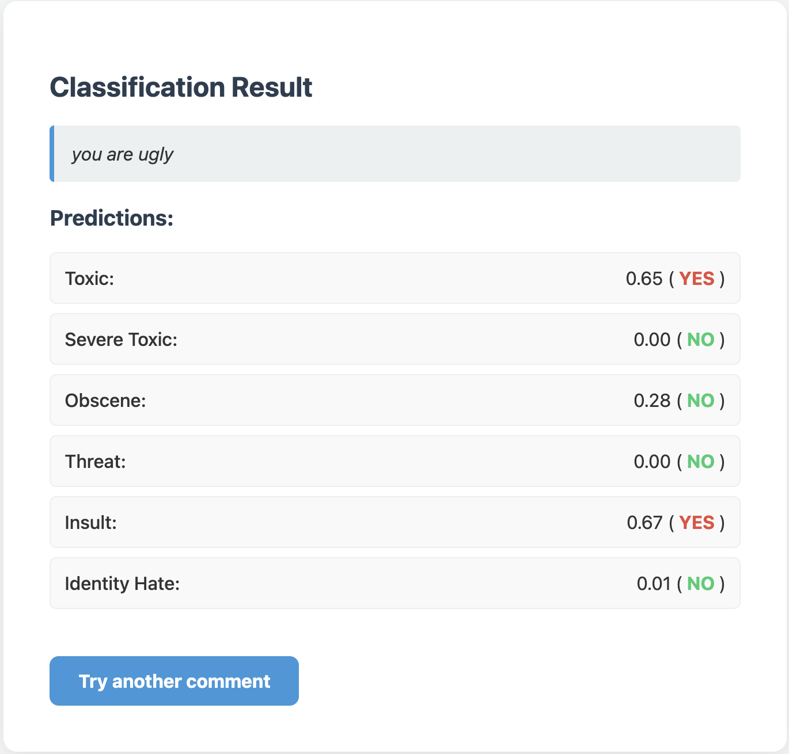

# Toxic Comment Classification

> **A strong modern transformer-based classifier for toxic comments, featuring robust augmentation and transformer-based architecture.  
> Deployed for instant testing via HuggingFace Spaces.**

---

👉 [Live on HuggingFace Spaces](https://huggingface.co/spaces/malasya/toxic-comment-classifier)



---

## 🚀 Quick Start

Install requirements:
```bash
pip install -r requirements.txt
```
Run local demo:
```bash
python src/main.py
```
Or test inference in Python:
```bash
from src.predictor import predict
print(predict("I hate you"))
```
---

## Intro

This project was highly inspired by [Jigsaw Toxic Comment Classification Challenge](https://www.kaggle.com/competitions/jigsaw-toxic-comment-classification-challenge) which is a challenge on [Kaggle](https://Kaggle.com) provided by Jigsaw (Google).

My aim was to create a DIY pipeline which show high perfomance on the given dataset.
During my work I did not use any existing solutions, instead I created my own pipeline from scratch meaning any similarities (if any) with already existing submissions on this challenge are not intentional.

---

## Data

Model is trained on [Jigsaw Toxic Comment Classification Challenge](https://www.kaggle.com/competitions/jigsaw-toxic-comment-classification-challenge) dataset. The dataset represents a **multi-label problem** with six categories:

- toxic
- severe_toxic
- obscene
- threat
- insult
- identity_hate

For training, I performed **stratified splits** to ensure label balance and used validation sets for robust metric tracking.

---

## Data Augmentation

Toxic comments are, as usual, a minority compared to clean ones. To improve generalization and combat class imbalance, I applied **contextual data augmentation** on minority classes.  
Techniques included:

- **Synonym Replacement** (via `nlpaug`/WordNet) — replaces words in toxic comments with their synonyms, preserving context.
- **Random Swap** — shuffles positions of random word pairs.
- **Random Deletion** — removes random words, simulating noisy user input.

Augmentation is applied **selectively**: only to comments containing at least one positive toxic label.

---

## Model & Training

The core of the classifier is **DistilBERT** (via HuggingFace Transformers), fine-tuned for multi-label classification.

Key steps:

- Texts tokenized and padded/truncated for efficient batching.
- **DistilBERT** is followed by a custom classification head (dense layers with dropout).
- **FocalLoss** as the loss function, allowing the model to predict multiple classes simultaneously.
- **AdamW optimizer** and **CosineAnnealingLR** scheduler for efficient convergence.
- Training monitored with real-time **ROC-AUC**, **F1**, **Precision**, and **Recall**.

Early stopping is implemented to avoid overfitting, and the best model is saved based on validation ROC-AUC.

To retrain the model on your own data:

1. Prepare your dataset as `data/your_file.csv` with columns:  
   `"id", "comment_text", "toxic", "severe_toxic", "obscene", "threat", "insult", "identity_hate"`
2. Generate new embeddings and labels by running:  
   `python src/embeddings.py`
   - This will produce `data/embeddings.pt` and `data/labels.npy`.
3. Run `python src/model.py` to train the model.
4. After training, you will get `src/toxic_comment_classifier.pt` with weights of your trained model. 
---

> Make sure to adjust paths in config if your file locations differ.
---

## Evaluation

On the holdout validation set, the model achieves:

- **ROC-AUC:** 0.97
- **F1-score:** 0.83

Predictions are calibrated post-hoc with custom thresholds per label (optimized on validation scores).

---

## Deployment & Demo

For fast prototyping and community feedback, the solution is deployed as a [HuggingFace Spaces demo](https://huggingface.co/spaces/malasya/toxic-comment-classifier), built on top of a minimal FastAPI backend with HTML templates for input/output.

To ensure reproducibility, all source code, configuration, and requirements are available in the GitHub repo. Heavyweight artifacts (model weights, embeddings) are hosted externally.

---

## Practical Tips & Lessons

- **Selective Augmentation:** Applying contextual augmentation & undersampling of majority improved F1 score by 18%
- **Threshold Optimization:** Instead of naive 0.5 thresholding, finding best per-class thresholds led to more balanced performance, especially on severe_toxic and threat labels.

---

## Credits
- **Model:** [DistilBERT by HuggingFace](https://huggingface.co/distilbert-base-uncased)
- **Augmentation:** [NLPaug](https://github.com/makcedward/nlpaug)
- **Data:** [Jigsaw Toxic Comment Classification Challenge](https://www.kaggle.com/competitions/jigsaw-toxic-comment-classification-challenge)


*Full code, instructions, and links to pre-trained weights are available in the repository.*
